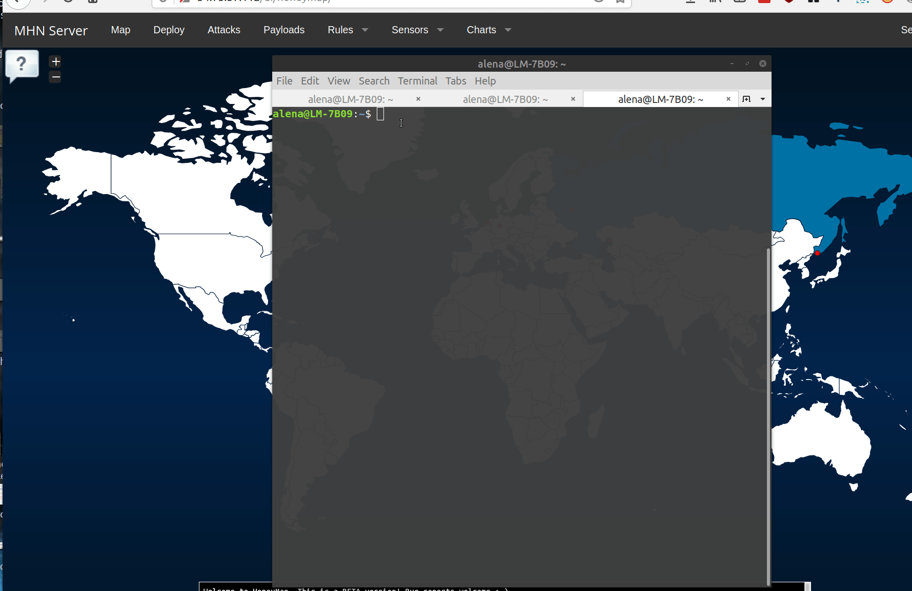
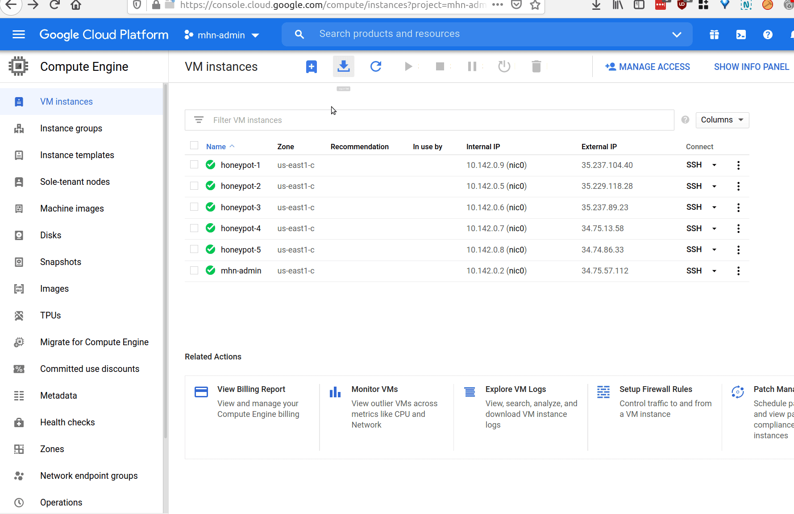
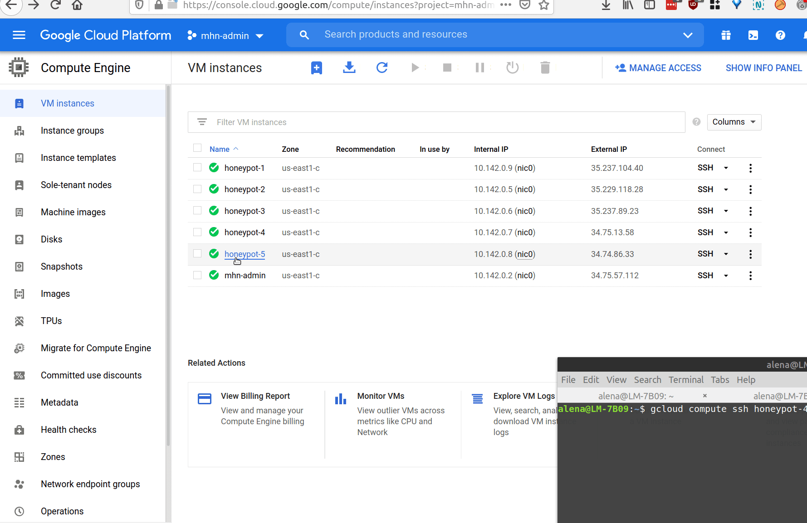
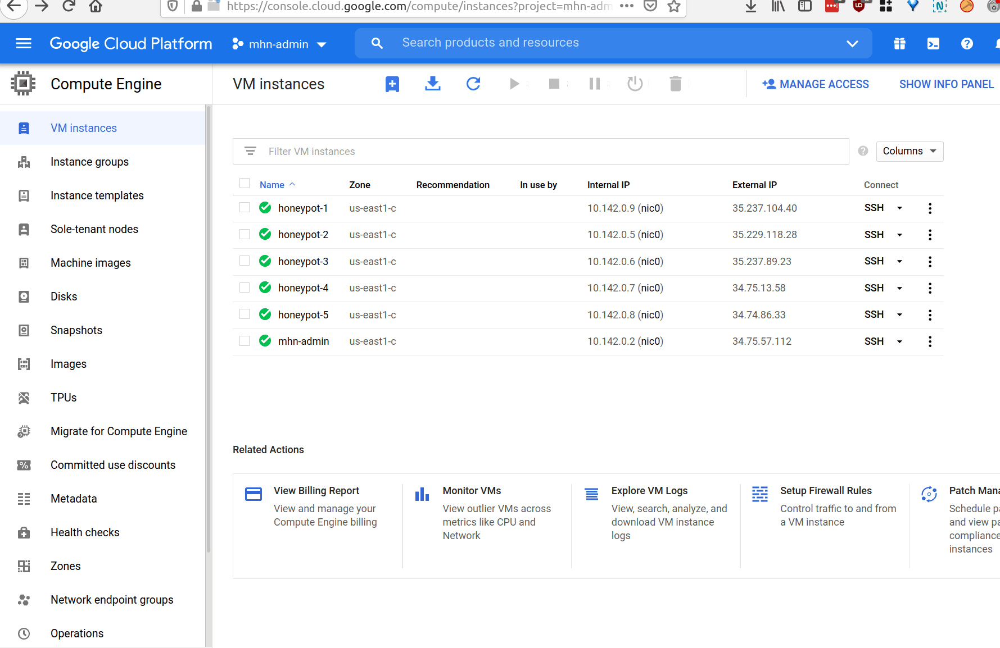
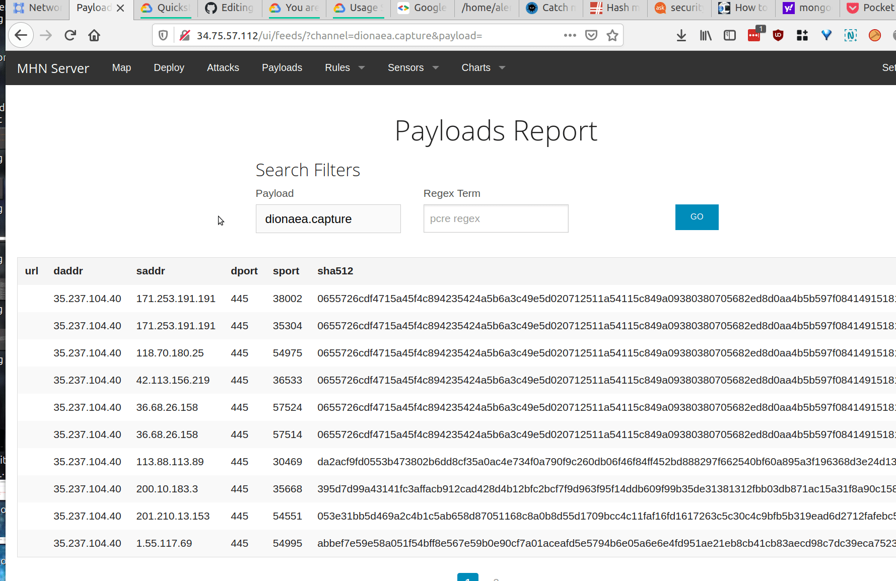

# Honeypot Assignment

**Time spent:** **10** hours spent in total

**Objective:** Create a honeynet using MHN-Admin. Present your findings as if you were requested to give a brief report of the current state of Internet security. Assume that your audience is a current employer who is questioning why the company should allocate anymore resources to the IT security team.

### MHN-Admin Deployment (Required)

**Summary:** How did you deploy it? Did you use GCP, AWS, Azure, Vagrant, VirtualBox, etc.?
I used GCP which was super easy and user-friendly! 

### Dionaea Honeypot Deployment (Required)

**Summary:** Briefly in your own words, what does dionaea do?

Dionaea is used to collect and store information about all different kinds of malicious traffic/attacks from all over the world.

### Database Backup (Required) 

**Summary:** What is the RDBMS that MHN-Admin uses? What information does the exported JSON file record?
  
 The command that is given to us to extract the db content into json file gives a hint that MHN-Admin uses MongoDB database system:
       
    $ mongod --version
    db version v3.6.3
    ...
    
Although, MongoDB is a NoSQL database. Hence, I could suppose that Google Cloud SQL is used based on MySQL database. Scanning with Nmap of several honeypot VM's revealed open ports used by mysql database. But regarding the mhn-admin I can't tell for sure.
  
The __session.json__ file, however, is a typical output dumb of the mongodb. It shows the ID of the attack, attack PROTOCOL, the PORT used for that attack, TIMESTAMP, DATE, SOURCE_IP address and SOURCE_PORT (an IP and port of an attacker), DESTINATION_PORT, IDENTIFIER hash, and the sensor HONEYPOT name.
    
MHN-Admin
*Be sure to upload session.json directly to this GitHub repo/branch in order to get full credit.*

### Deploying Additional Honeypot(s) (Optional)

#### Shockpot Honeypot

**Summary:** What does this honeypot simulate and do for a security researcher?

#### Snort Honeypot

**Summary:** What does this honeypot simulate and do for a security researcher?
Snort sensor is open source IPS (intrusion prevention system). It can analyse network traffic in real-time. It also logs the packets.

#### p0f Honeypot

**Summary:** What does this honeypot simulate and do for a security researcher?

#### Cowrie Honeypot

**Summary:** What does this honeypot simulate and do for a security researcher?

### Malware Capture and Identification (Optional)

I run both ClamAV on the dionaea honeypot and used VirusTotal site, because there were several malware whch were not caught by the antivirus. For VirusTotal, I used MD5 hashes found at mhn-admin webserver in 
__Payloads Report__.

The following are the first 3 lines of the ClamAV log of infected files (report_clamav_dionaea.txt):

    1) /opt/dionaea/var/lib/dionaea/binaries/95ae8e32eb8635e7eabe14ffbfaa777b: Win.Ransomware.WannaCry-6313787-$
    2) /opt/dionaea/var/lib/dionaea/binaries/6567e663303386b7152d5fcab1f06cac: Win.Ransomware.WannaCry-6313787-$
    3) /opt/dionaea/var/lib/dionaea/binaries/fc1e617b1ff659f1826868baedc9c258: Win.Ransomware.WannaCry-6313787-$

Although having different hashes, all three seem to be the same malware related to the famous WannaCry ransomeware.

#### Malware  CVE-2017-0147 (Ransom:Win32/CVE-2017-0147.)

This is a PE32 executable for MS Windows (DLL) (GUI) Intel 80386 32-bit.
Target Machine: Intel 386 or later processors and compatible processors 

**Summary:** How did you find it? Which honeypot captured it? What does each malware do?

It was captured by Dionaea. This malware is a trojan that was used in WannaCry Ransomware. It's a SMBv1 server that allows remote attackers to obtain sensitive information from process memory via crafted packets, aka "Windows SMB Information Disclosure Vulnerability." 

This malware 
MD5 Hash:   95ae8e32eb8635e7eabe14ffbfaa777b
SHA1 Hash:  d5872c3f694a9e23c0583c4ae3e5c59eab26c021 

MD5 Hash:  6567e663303386b7152d5fcab1f06cac
SHA1 Hash: fc2ce59f87aa3688e20880d68b6bbb5cbffa2080

MD5 Hash:  fc1e617b1ff659f1826868baedc9c258
SHA1 Hash: d7dea5b421b2c0cced2a4f6b9c5d726889a94921 

______________________________________________________________________________________________
#### Malware: Trojan/Win32.Downloader.R210634 

Caught by the 

**Summary:** How did you find it? Which honeypot captured it? What does each malware do?

It was captured by Dionaea. ClamScan did not capture this one. I found it in the __Payloads Report__. And searched at VirusTotal.
This malware is a generic trojan for Win32 bit that downloads and installs files. A trojan software looks legitimate, but can be actually very malicious. It even can be downloaded onto a device without the user's knowledge or concent. When installed, the malicious software can damage, disrupt, steal or cause other harm to the user's data or computer.

MD5:   b3812008522d080fcbdec1adc499df2b
SHA-1: 3e2781587ffeb521a6fc40a9c1bcd67d3d670926 

## Notes
Describe any challenges encountered while doing the assignment.

