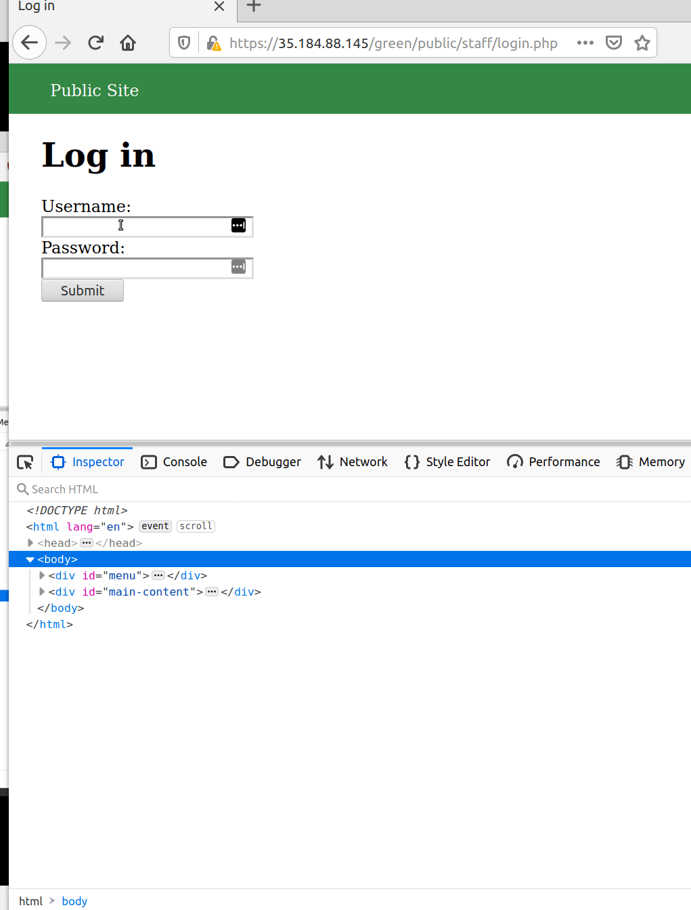

# Project 8 - Pentesting Live Targets

Time spent: **6** hours spent in total

> Objective: Identify vulnerabilities in three different versions of the Globitek website: blue, green, and red.

The six possible exploits are:

* Username Enumeration
* Insecure Direct Object Reference (IDOR)
* SQL Injection (SQLi)
* Cross-Site Scripting (XSS)
* Cross-Site Request Forgery (CSRF)
* Session Hijacking/Fixation

Each color is vulnerable to only 2 of the 6 possible exploits. First discover which color has the specific vulnerability, then write a short description of how to exploit it, and finally demonstrate it using screenshots compiled into a GIF.

## Blue

Vulnerability #1: _______SQL Injection___________

Description: There are several ways to show an SQLi vulnerability of the blue target. One of them is to click on the ___Find a Salesperson___ tab --> click on any salesperson --> then replace the id's value in the url for 

    'union select database(); --'    
or
    
    'or sleep(10)=0; --'
    
Where in the first case the attacker will get the message "Database query failed.", thus confirming that the site is sqli-vulnerable. The same actions upon the red and green targets do not result in any message at all. 

In the second case, the script makes the blue target not-responsive for 10 seconds (while showing the same database query faild message). Again, the red and green targets do not react to this injection.

Vulnerability #2: ___Session Hijacking/Fixation___

Description: To recreate this exploit, I used to browsers: Firefox and Tor Browser. First, I made sure I'm logged out from both of the pages. After what I logged into the Firefox and found the PHPSESSID by pasting the following sript into the url:

    https://35.184.88.145/blue/public/hacktools/change_session_id.php
    
I copied the cookie, opened another blue target in the Tor Broweser, and clicked on ___Login___ tab from the ___Public Site___ page. Then, by using the same script from above, I was able to log into the pperson's account without "knowing" neither the username nor the password. 

## Green

Vulnerability #1: ___Stored Cross-Site Scripting (XSS)___

Description:  The ___Contact___ form of the green target is the perfect spot for the stored/persistent xss. Any user can post a feedback, and, if overlooked, this exploit can cause a lot of damage. I used the following script to recreate the exploit:

    
Thank you for your sevice!
<iframe src="javascript:alert('AC found XSS!')" height="0" width="0"></iframe>
    
I posted it into the ___Fedback___ field from the public site (before logging in). After the form is submitted, every registered user will get exposed to this vulnerability, since the script doesn't envolve user interaction. 

Vulnerability #2: ___Username Enumeration___

Description: If the log-in was not successful, regardless of the reason, the users is supposed to be notified about it with a bolded message/marker: "Log in was unsuccessful". That's the default behavior on both red and blue targets. The green target, although, has a vulnerability whicht makes the the user distinguish the login faliure due to the wrong username vs the wrong password. This vulnerabilty is due to the typo in its html code: under the  tag, the class attribute has a value "failed" instead of the correct "faliure". This makes the text prompt appear in bold if the username is correct (wrong password) and not in bold when the username is wrong. The gif shows how this issue can be fixed by inspecting the element.

## Red

Vulnerability #1: ___Insecure Direct Object Reference (IDOR)___

Description: The red target had an IDOR vulnerablity, which could be recreated by going to the __Find a Salespersons__ tab of the public profile, then clicking on any of the salesperson's names, and changing the id # in the url for 10 or 11. That action reveals 2 people's data that is not supposed to be public. In the end of my gif, it's clear that the blue target (as well as green) doen's have this vulnerabilty.

Vulnerability #2: ___________Cross-Site Requiest Forgery (CSRF)_______

Description: 

## Notes

Describe any challenges encountered while doing the work

## License

Copyright 2020 Alena Chernenko

